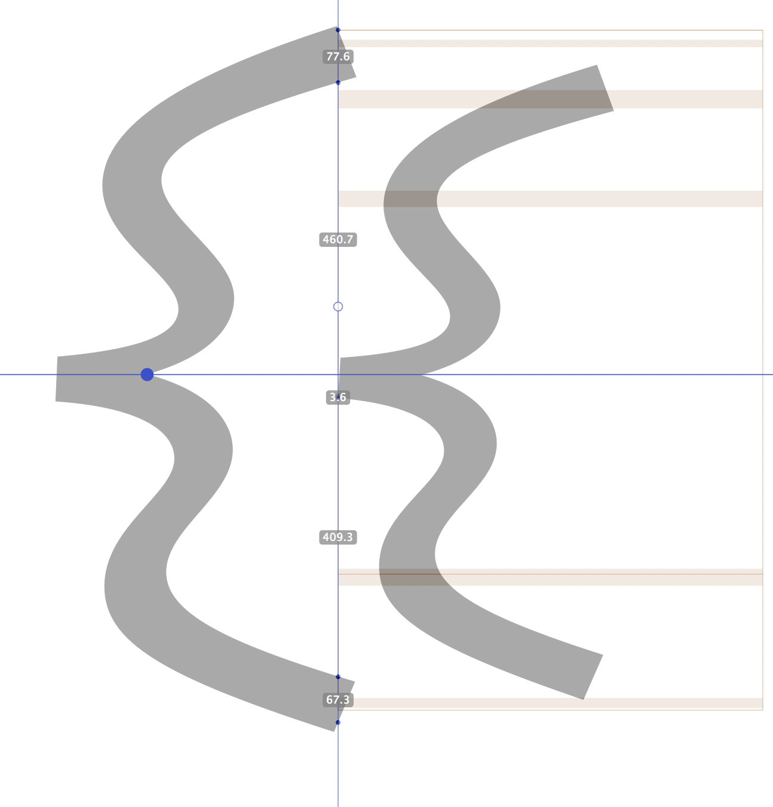

# \`{{\` and \`}}\`

## Creating the \`{{\` and \`}}\` ligature \(Roman\)

1. Create an empty ligature glyph
2. Add the `braceleft` component twice, or `braceright` component twice.
3. Create a guide \(Right-click -&gt; Add Guide\)
4. Set the settings on the guide as so:

For whichever brace is the "inner-brace", change the dimensions as so, changing only the size \(the `%` in the middle column\) and the rotation \(the right most setting\):

Move the left-most brace to the left and the right-most brace to the left so the top/bottom parts cross the middle guide and the numbers are like so:

Create a new guide  and move the guide so it intersects the pointy inner-corner of the larger brace

Move the smaller brace vertically \(up/down\) so the two pointy inner-corner bits cross like so:

## Creating the italic ligature

Repeat all the steps as above ligature above **BUT set the middle guide** **to**:

## Final ligatures

